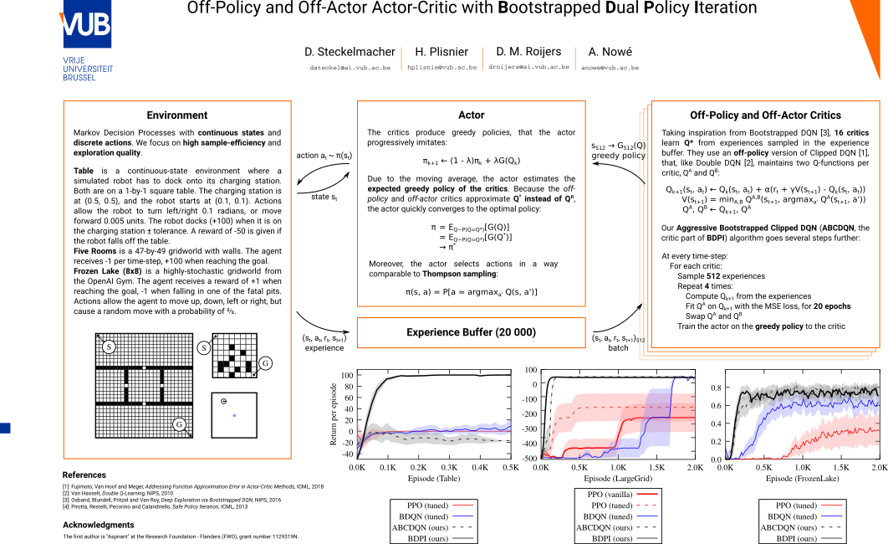

# Sample-Efficient Reinforcement Learning with Bootstrapped Dual Policy Iteration

This repository contains the complete implementation of the Bootstrapped Dual Policy Iteration algorithm we developed over the past year and a half. The repository also contains scripts to re-run and re-plot our experiments.

## What is BDPI?

BDPI is a **model-free** reinforcement-learning algorithm for **discrete action** spaces, **continuous or discrete state** spaces, written in **Python** with **PyTorch** and to be used with **OpenAI Gym** environments. This implementation, by its use of feed-forward neural networks, is tailored to **Markov Decision Processes** (not POMDPs).

## How is it different?

Many reinforcement learning algorithms exist. BDPI is different from them in several key points:

* It uses one actor and **several critics**. Bootstrapped DQN uses several critics but no actor, A3C uses several actors but no critics.
* The critics are **off-policy**. Conventional actor-critic algorithms have their critic evaluate the actor, so that the actor can use the critic to get slightly better. BDPI has its critics learn the optimal Q-Function, without paying attention to what the actor does. The actor then imitates the critics.
* BDPI is **good at exploration** while being **extremely simple**. Algorithms such as RUDDER are very good at exploring, and Information-Directed Sampling seems quite promising in stochastic environments. However, these algorithms are long, complex and difficult to implement (but also extremely interesting to study!). BDPI combines simple critics with a simple actor, using less than 500 lines of Python code (and those lines include many variants and configuration parameters we use in the paper). Yet, BDPI exhibits exploration superior to any non-exploration-focused algorithm, such as PPO, ACKTR, Bootstrapped DQN, A3C and ACER.
* BDPI is **almost trivial to apply to new tasks**. We configured BDPI for FrozenLake, an easy-to-explore but highly-stochastic gridworld. The parameters that performed well (`--layers 1 --hidden 32 --er 256 --erfreq 1 --actor-count 16 --loops 16 --qloops 4 --epochs 20 --lr 0.0001`) were used as-is on LunarLander and Table, continuous-state environments that are much harder to explore. And these parameters worked flawlessly on the first try, crushing all the other algorithms. We also evaluated BDPI, with these same parameters, on other environments developed in our lab (one of them is LargeGrid, available in this repository). Again, these parameters provided state-of-the-art performance (see poster.pdf, which has results on LargeGrid).
* BDPI is **not gradient-based**, contrary to any other actor-critic algorithm, and most recent critic-only algorithms. Our equations produce target Q-Values and probabilities, that can simply be stored in a table, regressed with an SVM, put into a Gaussian mixture model, or fitted with a neural network, on the mean-squared-error loss, for as many training epochs as desired.

## Overall Idea

The poster presents the general architecture of BDPI:

Explaining BDPI can be done by following the loop:

* The actor receives a state and outputs a probability distribution over actions. The agent samples one action and executes it in the environment. Note that BDPI does not assume the actor to be the behavior policy, so if you want to tamper with what the actor outputs (to add safety for instance), you can. BDPI is for practical real-world RL :) .
* The environment produces a next-state and a reward. That, combined with the current state and action, forms an experience added to the experience buffer.
* Every so often (16 times per time-step in our experiment, for maximum sample-efficiency):
    * A batch of experiences is sampled from the experience buffer.
    * A critic, among 16, is sampled from the set of critics.
    * The chosen critic is updated with our Aggressive Bootstrapped Clipped DQN update rule, on the batch of experiences.
    * The updated Q-Values are used to compute greedy actions. The agent now has a set of states (from the experiences) mapped to greedy actions.
    * The actor is trained to imitate these greedy actions

Because the actor has a learning rate, it learns the **expected greedy policy** of the critics, that, being trained off-policy, learn the **optimal Q-Function**. And because the greedy policy of the optimal Q-Function is the optimal policy, the **actor learns the optimal policy**. The way the actor moves towards that optimal policy closely resembles Thompson sampling, empirically shown to be an extremely good exploration strategy. This may explain why our results look so "BDPI learns immediately while the other algorithms are flat lines", BDPI almost perfectly balances exploration and exploitation, even though it does not have any advanced feature like novelty-based exploration, reward shaping, or reward rewriting.

## Where are the Atari games?

In the paper, we discuss why we did not perform any experiment on the Atari games. The general idea is that Atari games can be learned with DQN (and its more recent variants, such as Rainbow). All these variants share common traits, such as using a small batch size (32 experiences), training the Q-network for only a single epoch per time-step, or using a target network. All these traits are mandatory. When we change the batch size (in any direction!), DQN fails to learn any game. If more than one training epoch is performed, DQN breaks. If the target network is removed, DQN breaks. Even more importantly, if we sample two batches of experiences per time-step (instead of 1), and apply DQN to each of these batches in an attempt to double its sample-efficiency, DQN breaks.

Given what we observed works on the Atari games, we configured BDPI according to these parameters. That is, a batch size of 32, a target network instead of Clipped DQN, and training the neural network for only a single epoch. We kept our several critics and the actor. The good news is that it worked quite well, be obtained encouraging results on Montezuma's Revenge where BDPI manages to consistently get the key, and quite often leave the first room. This is exceptional for an algorithm without novelty-based exploration or any other advanced feature! But the general sample-efficiency of BDPI was almost exactly the same as DQN. More importantly, was it still BDPI? Our contributions are aggressive critics, training for several epochs, and using large batch sizes. If we remove all that, we are not evaluating BDPI anymore, we are evaluating a couple of DQN critics with an actor.

So, we decided to dedicate time and patience to the Atari games, find out why they need such precise parameters (a batch size of 64 or 16 fails, but 32 works, why!?), then come back with the full and complete BDPI algorithm on Atari games.

## Source Code

The following components are available in this repository

* The complete Python 3 source code of our algorithm;
* Two OpenAI Gym environments: Five Rooms and Table (FrozenLake8x8 and LunarLander are available in the OpenAI Gym);
* Scripts to re-run all our experiments in a fully automated way.
* A benchmark that we use to [evaluate hardware on a scientific workload](https://www.reddit.com/r/Amd/comments/9mhr5q/amd_threadripper_2990wx_for_scientific_workloads/).

The files are organized as follows:

* `gym_envs/`: Gym environments.
* `main.py`: A simple RL agent that performs actions in a Gym environment, and learns using BDPI
* `bdpi.py`: The BDPI learning algorithm (actor, critics, and glue between them)
* `experiments_gym.sh`: A script that produces a job description for a given environment. Run an experiment with `./experiments_gym.sh table && cat commands_table.sh | parallel -jCORES`

## Dependencies

Reproducing our results require a computer with the following components:

* A recent Linux distribution
* Python 3, with `gym`, `lzo` and PyTorch
* GNU Parallel
* Gnuplot
